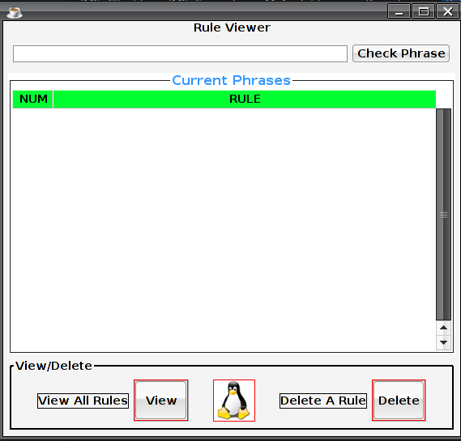
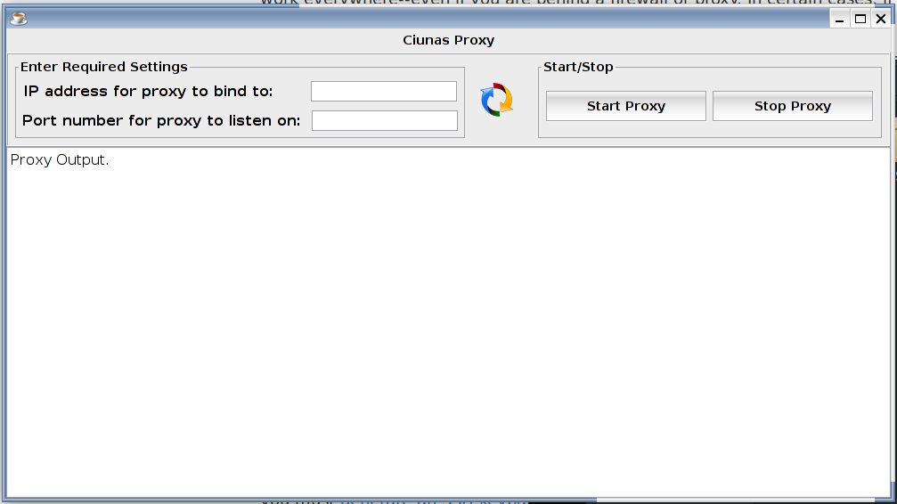

# finalYear-GMIT-Project
To build a network function chain in a private cloud and then use it to deploy an application. Building networking functions is a very interesting topic, and being able to test in a cloud environment is a great way of proving them for usability. The network functions will be made up of different parts, a firewall a proxy and a web filter. Coding these different parts is my plan, once they are made I will deploy them in a cloud environment (Openstack). I am going to create an instant messaging application behind these network functions, on a network I create in my private cloud. The instant messaging application will run from a central server and then each user will connect to it. I am going to have a translation function to my messaging service so a user can talk to any other user without the problem of a language barrier.

